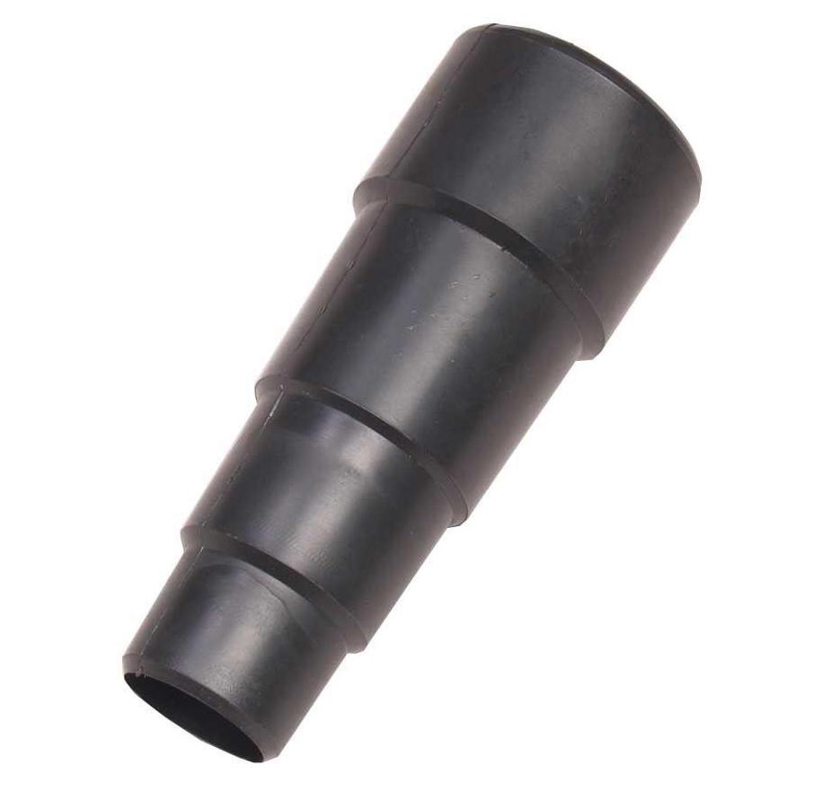
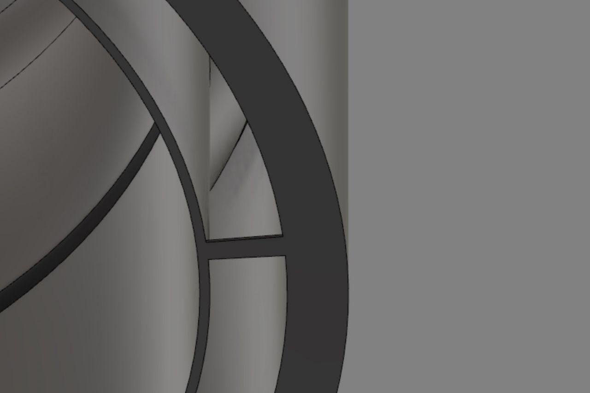
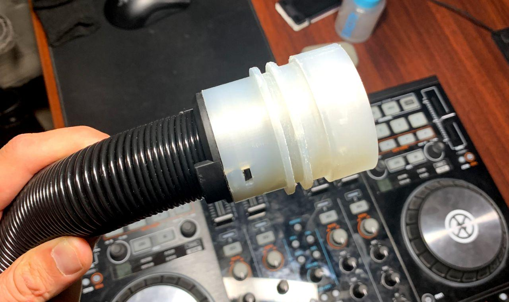

+++
title = "Wen drywall sander to Fein dust extractor 3D printed adaptor"
date = 2019-08-28

[taxonomies]
tags = ["3d printer", "project", "garage"]
+++

I don't think I have ever encountered two vacuum hoses or attachments that fit together, that didn't come in the same box. When I bought my current dust extractor, a [Fein Turbo-II](https://amzn.to/2MLobD1), I also purchased this soft plastic [hose adaptor](https://amzn.to/2ZzUsPs). It, combined with some shameful use of Gorilla tape, has allowed me to limp along for these past 6 years. Who knows how many water-inches of suction I have lost along the way!

<!-- more -->

This morning I was using my new Wen [drywall sander](https://amzn.to/2L4tawS) to remove some drywall texture. Everything was going great until I noticed the hose had come detached, there was no more suction, and the sander was flinging drywall dust all over the carpet, rendering the contraption utterly pointless. I said enough is enough and decided that this would be a perfect opportunity to take advantage of the 3D printer. Credit to [Marius Hornberger's](https://www.youtube.com/channel/UCn7lavsPdVGV0qmEEBT6NyA) [video](https://www.youtube.com/watch?v=k8mzMDLqENA) for planting this idea in my head.

{{ youtube(id="k8mzMDLqENA", class="embed-container") }}

It was a simple matter to get the dimensions off both vacuum hose attachments, and the sizes of the hose attachments were close enough that the transition between them didn't cause any issues.

I decided to try an idea that has been kicking around in my head, and instead of relying on the automatic support generation in [Simplify3D](https://www.simplify3d.com/), design the support in [Fusion 360](https://knowledge.autodesk.com/search-result/caas/sfdcarticles/sfdcarticles/How-to-activate-start-up-or-educational-licensing-for-Fusion-360.html). The majority of the support was a single layer width thick, widening out towards the top at a shallow angle I thought the printer would be able to handle with aplomb. I offset the top of the support by one layer-width horizontally (0.35 mm in my case), and two layer-thicknesses vertically (1.0mm), thinking to use the slicer's support material at the interface boundary.

_Left: cross-section of the completed adaptor. Right: the same cross-section, but showing the modeled-in-place support structures_

One small tip I have is to create a tiny (~ .2mm) bridge between the different bodies. This isn't the most elegant solution but it will save you time fussing with accurately positioning the different bodies relative to one another after importing them into the slicer. The printer will still put forth a valiant effort to print it, but being this tiny, any surface finish issues it causes will be the least of your worries.

The support material experiment was a moderate success. If I use this technique again, there are a few things I would do differently:

1. **Extend the outer platform.** With the outer edge of the support structure precisely aligned with the edge of the part above, there was a bit of drooping on the outside of the part.
2. **Don't use any slicer support generation.** The tiny back and forth of generated support made the print fairly messy at the interface layer. However, I worry that removing it would cause the molten plastic to adhere too strongly to the support, even with a layer or two of separation. Perhaps experiment with radial support spokes at the very top layers.
3. **Facilitate support structure removal.** With the support structure forming a continuous ring, it was difficult for a screwdriver or flush cutters to gain purchase. Plus I missed out on the satisfying support material crunch! Maybe the aforementioned support spokes could help with this as well.
4. **Experiment with the horizontal offset.** Somehow, even though there was only a single layer that wasn't fully supported, the layer managed to droop in between the part and the support. Some possible fixes could be partial-layer width offsets, or a tiny, two-layer bevel 45º bevel.

Overall the part turned out to be a success! The fit with the Wen hose is tight, but it snapped on in the end. I don't have the vacuum available to test the fit on the other end, but once I do I will make some adjustments to the part and the support structure and make another revision. Look for the conclusion to my support adventures, as well as a Thingiverse link to the finalized adapter in another post!

