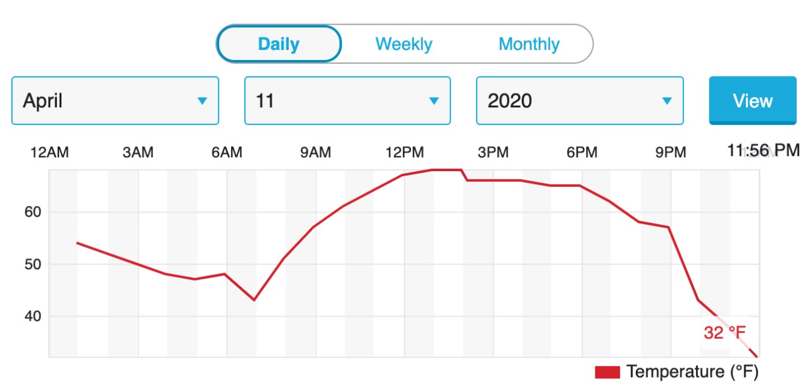
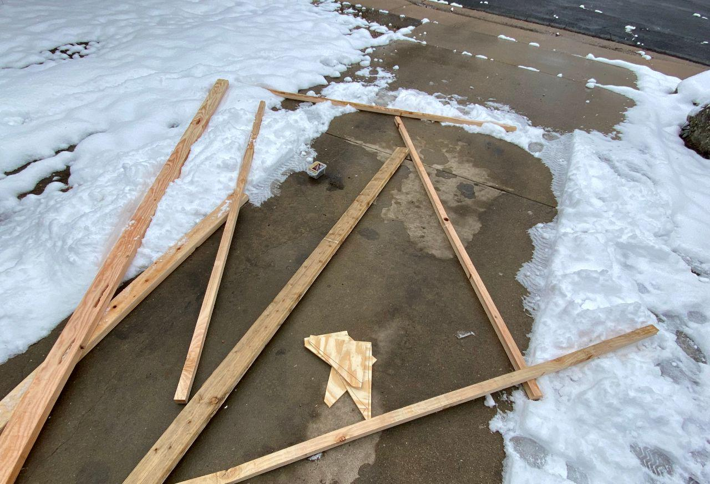
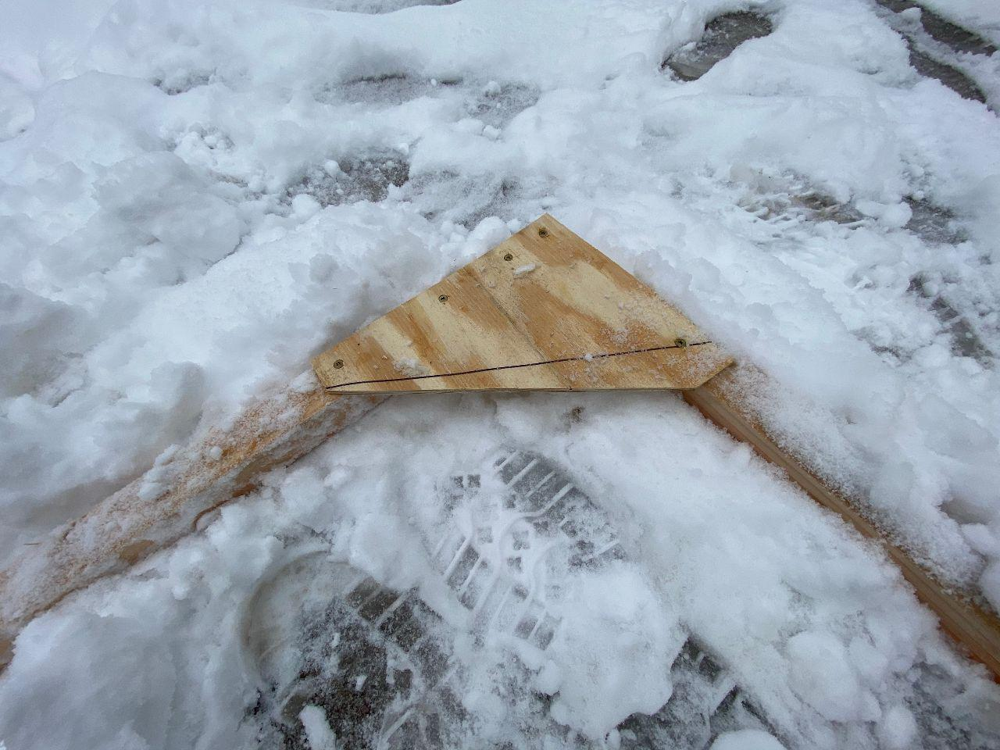
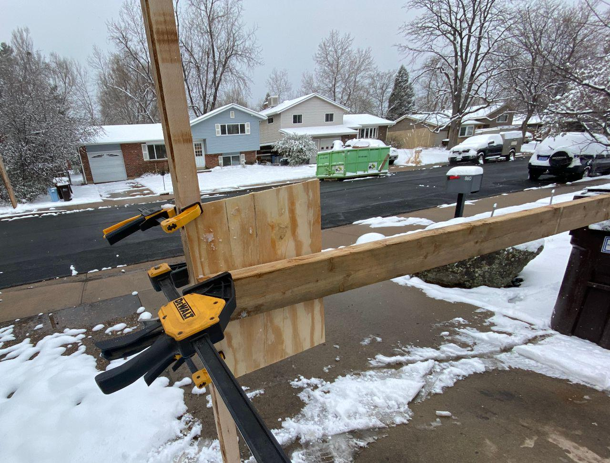
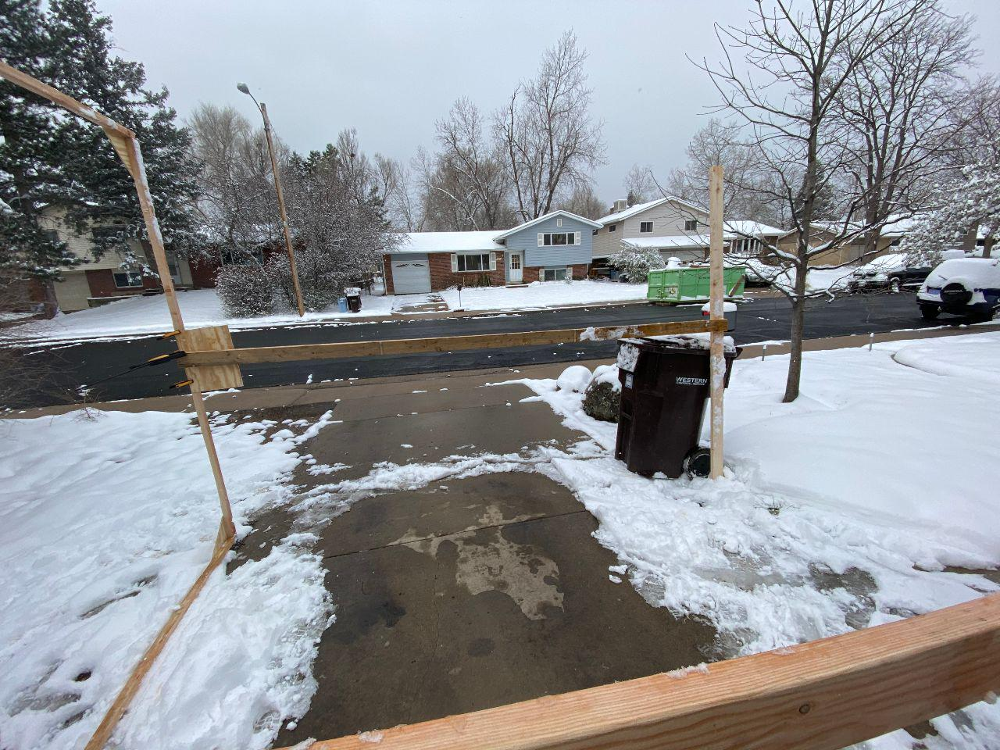
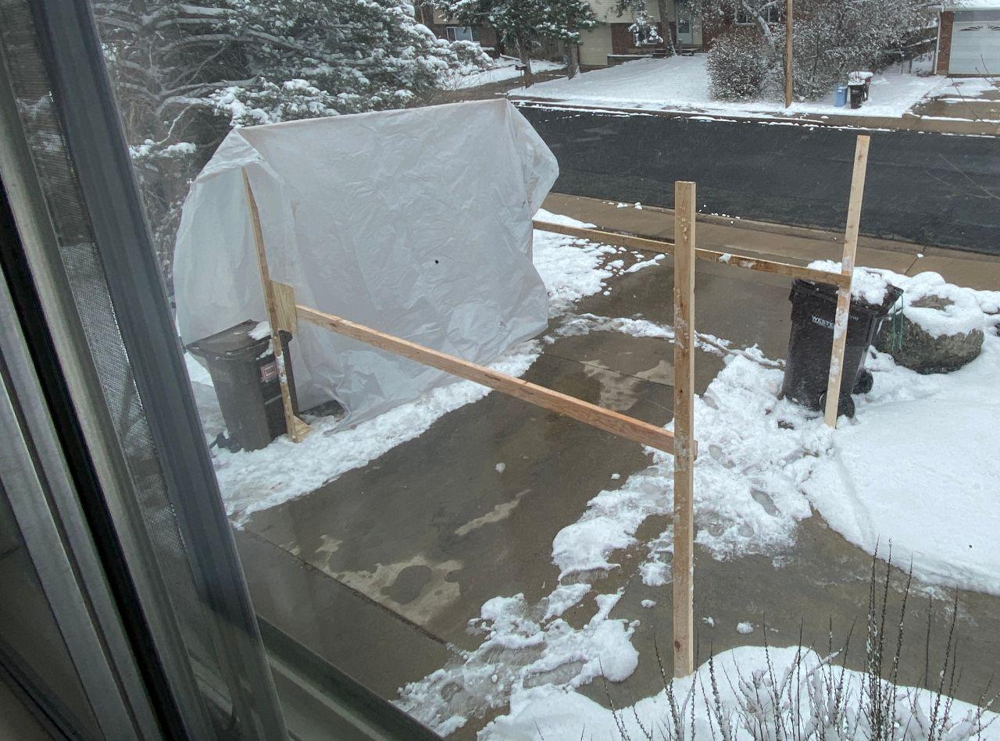
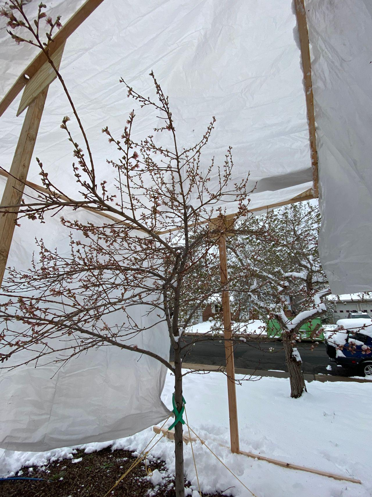
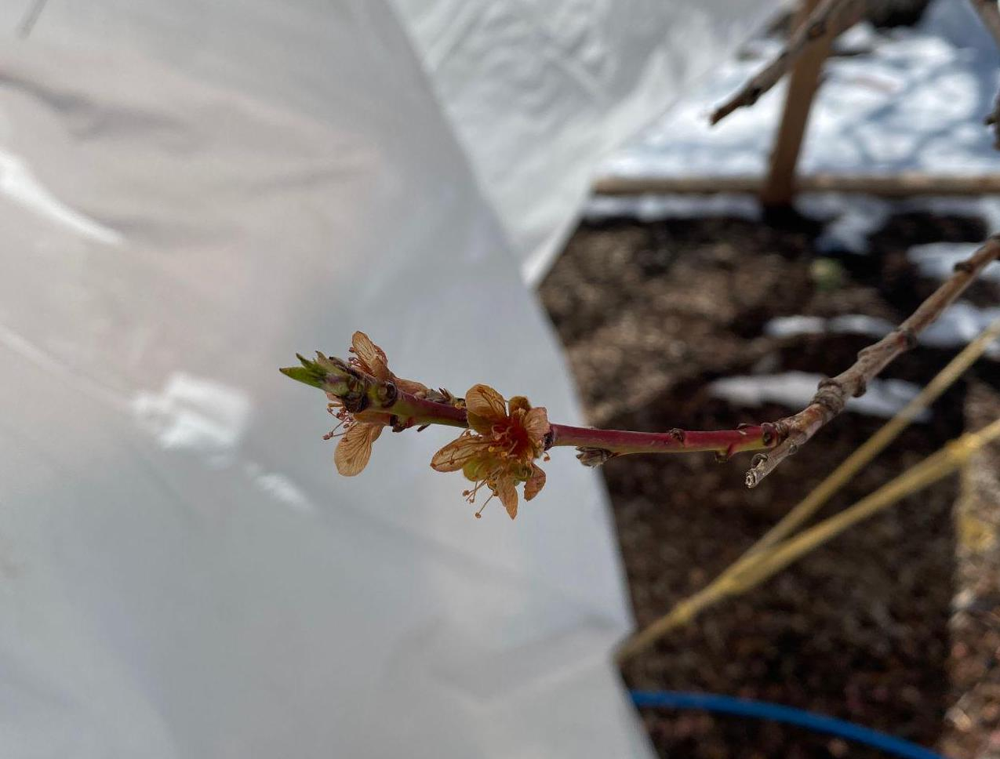

+++
title = "the worst thing I have ever made"
date = 2020-04-11

[taxonomies]
tags = ["project", "garden", "woodworking"]
+++

I love Boulder for many reasons. one of them is the roulette wheel that is spring weather. the winds are a changin', then next thing you know the t-shirt you were wearing seems silly for the 30 degree snowstorm you find yourself in.

<!-- more -->

_weather in Boulder changes fast_

now, the only problem with this is the two fruit trees in my yard. when it is 65º for the second week in a row, they start to think it is growing time. so, on the morning of April 11th, it was in a state of mild panic that I decided I was going to try to save the poor peach blossoms.

my idea was simple....too simple in retrospect. I would build a square out of 2x2s, brace the corners with plywood triangles, and support it on uprights made of 2x4s, with 2x4s for the legs. I dashed off to Home Depot (hopefully only once), and bought some wood, the crappiest I could find. pro tip—if you ask an employee if you can have damaged lumber for cheap, they will probably give it to you. I got mine for 70% off.

back at home I implemented my plan post haste. I'll let the pictures tell the story, but I think overall it went up pretty well, considering....

_corner braces cut, lumber...exists_

_corners look good in theory_

_innovative fixturing solutions_

_more awkward "fixtures"_

_behold! this thing._

_tree is covered!_

well, like it says on the top of the tin, this probably the worst thing I have ever made, but it was kinda fun, and it's done. here's to hoping.

_12 nov 2020_ surprising nobody, the roof broke from the weight of the absurd amounts of heavy, wet snow on it. one of my oh-so-awesome pieces of budget lumber had a big know in the middle of it, and while I was trying to knock the snow off it snapped, collapsing onto the tree. It is still keeping the snow off however, so I will leave it.

_14 nov 2020_ the blossoms are definitely dead. ☹️ I have had grand visions of a collapsible geodesic dome made of fiberglass rods and 3d printed connectors, so next year the defenses will be at maximum. probably need a heater inside the bubble too. in the meantime, we can hope some of the un-blossomed buds survived! ...long enough to die in Saturday's forecasted frost. sigh.

